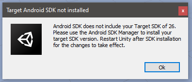

# Oculus Quest Starter Project
 
 ## What is this?
 This is a very simple Unity project that Builds & Runs succesfully on the Oculus Quest (hopefully on the Oculus Quest 2 too)  
 
 ---
 
 It uses the **Universal Render Pipeline** and includes all the **Oculus Integration Package Modules**.
 You probably won't need most of them (like Platform and LipSync, but they are included anyway)
 
 --- 
 
 Tested with Unity 2020.3.9. 
 If your Unity has the Android Module and Android SDK installed, this project should build succesfully on your Quest.
 For full walkthrough, see [here](https://developer.oculus.com/documentation/unity/unity-gs-overview/
)

---

If you get this error when trying to build:  

it means that Unity's default Android installation didn't include the necessary Android version that your app needs (for Quest, it's Android 26).  

Find it and download it from [here](https://androidsdkmanager.azurewebsites.net/SDKPlatform)  

Once downloaded, unzip it and place the whole folder in this location:

`C:\Program Files\Unity\Hub\Editor\YOUR UNITY VERSION\Editor\Data\PlaybackEngines\AndroidPlayer\SDK\platforms`

For example, if you are using Unity 2020.3.9f1, this path will be:
`C:\Program Files\Unity\Hub\Editor\2020.3.9f1\Editor\Data\PlaybackEngines\AndroidPlayer\SDK\platforms`
